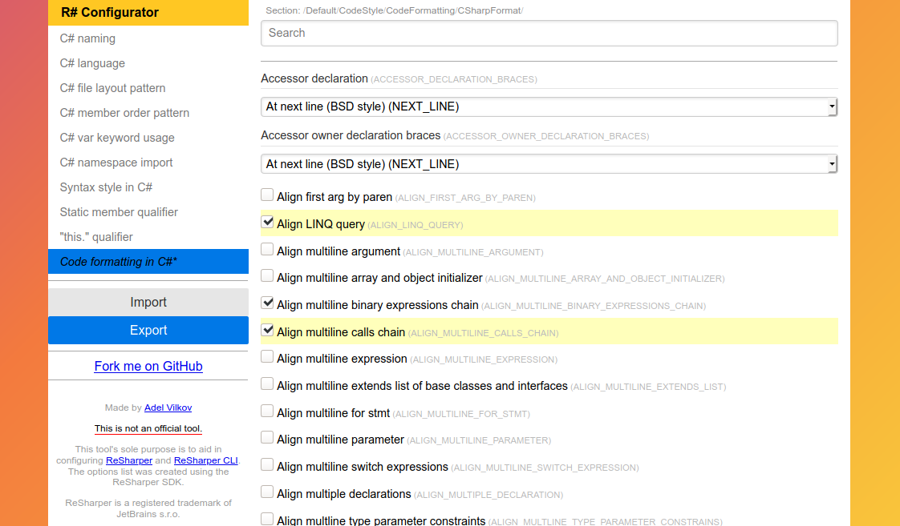

[](http://creativecommons.org/licenses/by/4.0/)

This work is licensed under a Creative Commons Attribution 4.0 International License.

---


# [Click to open the editor](https://razer-rbi.github.io/resharper-configurator)



# About the project
This project is an attempt to make an external GUI that can be used to configure
**JetBrains ReSharper** options which are commonly stored in .DotSettings files.

Exported settings should work in [ReSharper](https://www.jetbrains.com/resharper/)-enabled tools (VS extension, [free cross-platform CLI tools](https://www.jetbrains.com/rider/) and Rider).

Currently only C#-related formatting and naming settings are supported.

# Running locally
Clone the repository, make sure you have installed Node and do the usual install:
```
npm install
```
Then launch the development server with:
```
npm run serve
```

# Legal notes
This tool's sole purpose is to aid in configuring ReSharper and ReSharper CLI. The options list was created by using the ReSharper SDK.

There was no intention to harm, steal or exploit the intellectual property
embedded in the listed products. Please see the [Legal](https://www.jetbrains.com/legal) section on the JetBrains website for further legal information about the listed products
and their usage.

ReSharper and Rider are registered trademarks of JetBrains s.r.o.
All other trademarks identified herein are the property of their respective owners.